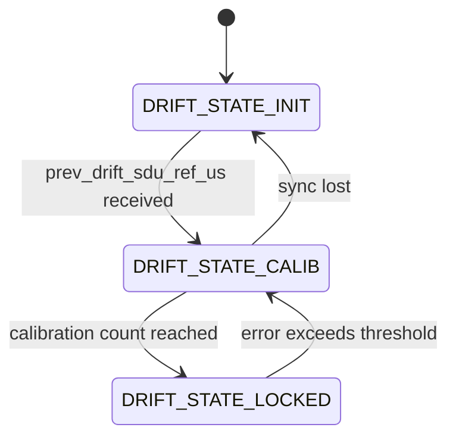

# Audio Pipeline Module Spec - nordic-wifi-audio

## Document Information

| Field | Value |
|---|---|
| Project | Nordic Wi-Fi Audio Demo |
| Version | 2026-06-22-15-18 |
| PRD Version | 2026-06-22-15-18 |
| NCS Version | v3.3.0 |
| Target Board(s) | nRF5340 Audio DK + nRF7002EK (P0); nRF7002DK, nRF54LM20DK + nRF7002EB2 (build) |
| Status | In Review |

## Changelog

| Version | Summary of changes |
|---|---|
| 2026-06-22-15-18 | Updated to PRD v2026-06-22-15-18: added peer-address resolution by mode (P2P = fixed IP, STA = mDNS); Opus STA-only constraint documented |
| 2026-05-27-23-14 | Initial spec derived from code (Mode C Reverse) |

---

## Overview

The audio pipeline covers capture → encode → transmit on the Gateway side, and
receive → decode → output on the Headset side. It consists of four source files:

| File | Role |
|---|---|
| `src/audio/audio_system.c` | Encoder/decoder thread lifecycle management |
| `src/audio/audio_datapath.c` | Audio drift compensation, presentation delay, I2S timing |
| `src/audio/sw_codec_select.c` | Codec abstraction layer (Opus / LC3 / raw PCM) |
| `src/audio/wifi_audio_rx.c` | RX frame handler, UDP frame protocol, decode dispatch |

---

## File Locations

```
src/audio/
├── audio_system.c/h       — encoder/decoder thread control
├── audio_datapath.c/h     — datapath, drift comp, HFCLKaudio (nRF53 only)
├── sw_codec_select.c/h    — codec selection abstraction
└── wifi_audio_rx.c/h      — UDP frame protocol, decode, rx handler
```

---

## Zbus Integration

| Channel | Direction | Message type | Notes |
|---|---|---|---|
| `le_audio_chan` | Subscribe | `struct le_audio_msg` | `LE_AUDIO_EVT_STREAMING` / `LE_AUDIO_EVT_NOT_STREAMING` trigger encoder start/stop |
| `sdu_ref_msg` | Publish | `struct sdu_ref_msg` | Audio datapath publishes TX sync timestamps for drift compensation |

---

## UDP Frame Protocol

Defined in `src/audio/wifi_audio_rx.h`:

```
┌──────────┬──────────┬──────┬──────────────────┬──────────┬──────────┐
│ 0xFF     │ 0xAA     │ TYPE │ PAYLOAD (n bytes) │ 0xFF     │ 0xBB     │
│ START_1  │ START_2  │      │                  │ END_1    │ END_2    │
└──────────┴──────────┴──────┴──────────────────┴──────────┴──────────┘
TYPE: 0x00 = command, 0x01 = audio data
Command payloads: 0x00 = AUDIO_START, 0x01 = AUDIO_STOP
```

Max frame size: 1500 bytes (Wi-Fi MTU). Gateway TX size configured to 2048 bytes
(`CONFIG_NRF70_TX_MAX_DATA_SIZE=2048`) to accommodate raw PCM frames.

---

## Codec Abstraction

`sw_codec_select.c` wraps the codec behind a uniform interface. Selected at build time:

| Kconfig symbol | Codec | Default bitrate | Allowed modes |
|---|---|---|---|
| `CONFIG_SW_CODEC_NO_CODEC=y` | Raw PCM (no compression) | N/A | P2P and STA |
| `CONFIG_SW_CODEC_OPUS=y` | Opus (libopus v1.5.2) | `CONFIG_LC3_BITRATE` | **STA only** |
| `CONFIG_SW_CODEC_LC3=y` | LC3 | `CONFIG_LC3_BITRATE` | STA only |

**Raw PCM is the default codec** (enabled by `CONFIG_SW_CODEC_NO_CODEC=y` in `prj.conf`).
Opus is enabled via `overlay-opus.conf` and is **only valid in STA mode**.
**P2P + Opus must never be built in a single image** — the combined RAM of the WPA
supplicant P2P heap and libopus working set exceeds nRF5340 available RAM (NFR-005).

Bitrate range: `CONFIG_LC3_BITRATE_MIN` (6000) to `CONFIG_LC3_BITRATE_MAX` (320000).
Default: `CONFIG_LC3_BITRATE`.

---

## Peer Address Resolution

The headset (UDP client) must know the gateway's IP address before it can stream.
Resolution strategy depends on the Wi-Fi mode:

| Mode | Resolution strategy | Where implemented |
|---|---|---|
| STA | mDNS DNS-SD resolution of `audiogateway.local` | `socket_utils.c` existing DNS-SD path |
| P2P_CLIENT | Fixed GO IP `192.168.7.1` — no DHCP, no mDNS on P2P link | Set in `net_event_app.c` `dhcp_bound` hook |

Gateway (UDP server) binds to its own static/assigned IP and listens for packets.
In P2P_GO mode the gateway has static IP `192.168.7.1`; in STA mode it uses its DHCP-assigned IP.

The headset mDNS resolver code path is kept as-is for STA mode. The P2P_CLIENT path
bypasses DNS-SD and calls `socket_utils_set_target_ipv4()` directly from the hook.

---

## Audio Datapath — Drift Compensation

`audio_datapath.c` implements a drift compensation state machine:



`hfclkaudio_set()` adjusts the APLL frequency to compensate for clock drift
between gateway and headset. Guarded with `#if NRF_CLOCK_HAS_HFCLKAUDIO` — on
nRF54LM20A (no HFCLKAUDIO) this is a no-op.

---

## Kconfig Flags

| Symbol | Description | Default |
|---|---|---|
| `CONFIG_SW_CODEC_OPUS` | Enable Opus codec | n |
| `CONFIG_SW_CODEC_LC3` | Enable LC3 codec | n |
| `CONFIG_SW_CODEC_NO_CODEC` | Raw PCM, no compression | y (base) |
| `CONFIG_SW_CODEC_PLC_DISABLED` | Disable Packet Loss Concealment | y |
| `CONFIG_LC3_BITRATE` | Codec target bitrate (bps) | 96000 |
| `CONFIG_LC3_BITRATE_MIN` | Minimum allowed bitrate | 6000 |
| `CONFIG_LC3_BITRATE_MAX` | Maximum allowed bitrate | 320000 |
| `CONFIG_AUDIO_FRAME_DURATION_US` | Frame duration (7500 or 10000 µs) | 10000 |
| `CONFIG_AUDIO_SAMPLE_RATE_HZ` | Sample rate (16000 / 24000 / 48000 Hz) | 48000 |
| `CONFIG_AUDIO_BIT_DEPTH_BITS` | Bit depth (16 or 32) | 16 |
| `CONFIG_AUDIO_MUTE` | Enable audio mute feature | n |
| `CONFIG_AUDIO_TEST_TONE` | Enable test tone generator | n |
| `CONFIG_ENCODER_STACK_SIZE` | Encoder thread stack size (bytes) | 4096 |
| `CONFIG_ENCODER_THREAD_PRIO` | Encoder thread priority | 5 |
| `CONFIG_AUDIO_DATAPATH_STACK_SIZE` | Datapath thread stack size | 4096 |
| `CONFIG_AUDIO_DATAPATH_THREAD_PRIO` | Datapath thread priority | 4 |
| `CONFIG_AUDIO_SYNC_TIMER_USES_RTC` | Use RTC0 for audio sync timer (nRF53 only) | y (nRF53) |
| `CONFIG_STREAM_BIDIRECTIONAL` | Enable walkie-talkie bidirectional mode | n |

---

## API / Public Interface

### `audio_system.h`
```c
void audio_system_encoder_start(void);
void audio_system_encoder_stop(void);
int  audio_system_encode_test_tone_set(uint32_t freq_hz);
int  audio_system_encode_test_tone_step(void);
```

### `wifi_audio_rx.h`
```c
int  wifi_audio_rx_init(void);
void wifi_audio_rx_data_handler(uint8_t *p_data, size_t data_size);
void send_audio_command(uint8_t audio_command);   /* AUDIO_START_CMD / AUDIO_STOP_CMD */
void send_audio_frame(uint8_t *audio_data, size_t data_length);
```

### `streamctrl.h`
```c
uint8_t stream_state_get(void);                  /* STATE_STREAMING or STATE_PAUSED */
void    streamctrl_send(void const *data, size_t size);
void    streamctrl_handle_client_disconnect(void); /* SERVER role only */
```

---

## Error Handling

| Condition | Handling |
|---|---|
| Codec init failure | `LOG_ERR` + `ERR_CHK` macro (fatal halt) |
| Encode error | `LOG_ERR`, frame dropped, stream continues |
| Decode error | `LOG_ERR`, PLC substitution (if enabled), stream continues |
| RX queue full | Frame dropped, counter logged |
| Drift state machine sync lost | Reset to `DRIFT_STATE_INIT` |

---

## Memory Estimate

| Component | Flash (approx) | RAM (approx) |
|---|---|---|
| Opus codec | ~250 KB | ~12 KB encode state |
| audio_system.c | ~5 KB | ~2 KB thread stacks |
| audio_datapath.c | ~10 KB | ~4 KB + stack |
| wifi_audio_rx.c | ~5 KB | ~3 KB + msgq buffers |
| sw_codec_select.c | ~2 KB | — |

---

## Test Points

| UART log string | Expected condition |
|---|---|
| `Audio codec initialized` | SW codec init success |
| `Audio stream started` | `audio_system_encoder_start()` called |
| `Audio stream stopped` | `audio_system_encoder_stop()` called |
| `Drft comp state: CALIB` | Drift compensation calibrating |
| `Drft comp state: STEADY` | Drift compensation converged |
| `wifi_audio_rx: init done` | RX path ready |
