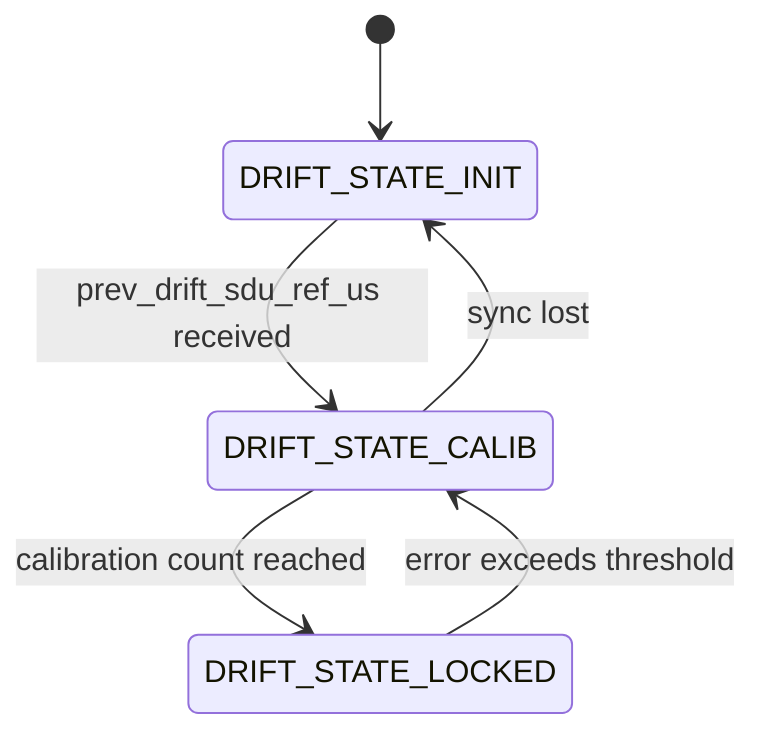
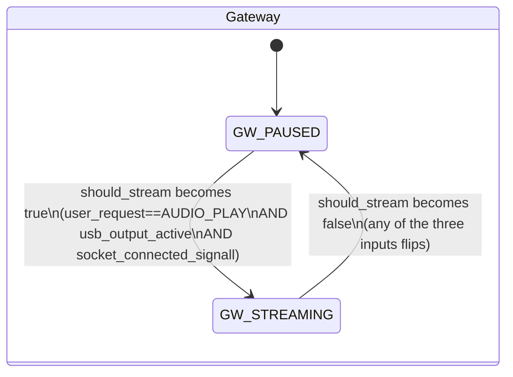

# Audio Pipeline Module Spec - nordic-wifi-audio

## Document Information

| Field | Value |
|---|---|
| Project | Nordic Wi-Fi Audio Demo |
| Version | 2026-08-07-09-29 |
| PRD Version | 2026-06-26-11-29 |
| NCS Version | v3.3.0 |
| Target Board(s) | nRF5340 Audio DK + nRF7002EK (P0); nRF7002DK, nRF54LM20DK + nRF7002EB2 (build) |
| Status | In Review |

## Changelog

| Version | Summary of changes |
|---|---|
| 2026-08-07-09-29 | Replaced the gateway's boolean `stream_paused_by_user` with an explicit `enum audio_user_request { AUDIO_PLAY, AUDIO_PAUSE }` and a single `gateway_reevaluate_stream()` that AND-gates streaming on `user_request == AUDIO_PLAY`, USB host output being active, and a client being connected. The local PLAY_PAUSE button now also sends `AUDIO_START_CMD`/`AUDIO_STOP_CMD` to the headset (previously only the headset's button notified the gateway — the gateway's button was a one-sided local toggle), so `user_request`-equivalent intent stays in sync on both sides. Added `streamctrl_handle_gateway_command()` on the headset (`CONFIG_SOCKET_ROLE_CLIENT`) plus command-frame recognition in `wifi_audio_rx_data_handler()` so the headset can receive these gateway-originated commands over the same UDP command channel. See "Audio Streaming State Machine" below. |
| 2026-08-07-09-00 | Replaced PCM-content-based USB host-idle detection with transport-level detection: `host_audio_active` now mirrors the USB OUT terminal's enable/disable state (`terminal_update_cb()`) directly instead of a sample-amplitude timeout (`host_audio_activity_check()`, removed). Real USB isochronous OUT transfers don't stop during a quiet passage or in-track silence, so the old content-based heuristic was pausing the Wi-Fi stream (and draining the headset's jitter buffer) on ordinary quiet music, not just genuine host-idle periods — likely the dominant cause of `Jitter buffer ran dry` events seen throughout testing. See "USB Host Audio-Activity Detection" below. |
| 2026-08-06-19-45 | Added `stream_paused_by_user` (gateway only) so an explicit pause (`AUDIO_STOP_CMD` or local PLAY_PAUSE button) stays paused even if the USB host resumes sending audio — previously `streamctrl_handle_usb_audio_active()`'s auto-resume only checked `strm_state == STATE_PAUSED`, which couldn't distinguish an explicit pause from a USB-idle auto-pause. See "Explicit pause vs. auto-pause" under Audio Streaming State Machine below. |
| 2026-08-06-15-00 | Added the "Audio Streaming State Machine" section: separate gateway/headset state diagrams for `STATE_STREAMING`/`STATE_PAUSED`, plus a trigger table covering all six independent sources that can flip that state (Wi-Fi hooks, socket protocol commands, USB host activity, local button, stream watchdog). Documents a known gap: the Wi-Fi-disconnect hooks (`net_event_app.c`) call `audio_system_encoder_stop()` directly without calling `stream_state_set()`, so `strm_state` can go stale after a Wi-Fi-triggered stop. |
| 2026-08-06-08-00 | Fixed two overnight-soak failures. (1) Permanent stream stall: the stream is downlink-only, so the AP disassociates the idle client (reason 4) and, once the gateway pauses on client-disconnect, nothing ever re-triggers it. Added `AUDIO_KEEPALIVE_CMD` (0x02) plus a 5 s headset stream watchdog that re-sends `AUDIO_START_CMD` when the RX frame count stops advancing; `AUDIO_START_CMD` on the gateway now honours USB host idle so recovery cannot override the silence pause. (2) Playback speed/pitch drift: `rate_ctrl_update()` reported `APLL_FREQ_CENTER` when not playing but never applied it, leaving `HFCLKAUDIO` wherever the servo last pushed it. |
| 2026-08-05-16-30 | Fixed a wire-framing bug: the tail fragment of a 2-datagram audio frame carried no header, so raw PCM/Opus payload bytes could coincidentally match the head's magic sequence and desync RX reassembly (`Invalid frame length ...` + multi-second audio dropout). Tail fragments now carry an explicit `SEND_DATA_TAIL_SIGN` (0x02) tag instead of being inferred from "no header", on both `send_audio_frame()` (gateway TX) and `wifi_audio_rx_data_handler()` (headset RX). Wire-protocol change — both images must be rebuilt/reflashed together. |
| 2026-08-05-11-00 | Gateway now detects whether the USB host is actively sending (non-silent) audio and pauses/resumes the Wi-Fi stream accordingly (`audio_usb.c` host-activity detection, `streamctrl_handle_usb_audio_active()`). Removed the headset-side "Audio streaming stopped"/"Audio streaming resumed" under-run hysteresis logging in `audio_datapath.c` (now redundant with gateway-side control); the jitter-buffer ran-dry/refilled mute logic is unchanged. |
| 2026-06-26-14-24 | Documented KNOWN LIMITATION: drift compensation is not wired up in the Wi-Fi path (sdu_ref timestamps commented out) → headset I2S clock drifts → periodic audible crackle. Added the Wi-Fi RX framing resync note. Both are pre-existing (independent of the UAC1→UAC2 migration). |
| 2026-06-25-13-35 | Updated to PRD v2026-06-25-13-30: square-wave test tone replaces LC3/CMSIS-DSP tone_gen (drops CMSIS_DSP); dual-mode peer resolution (P2P_GC fixed IP vs STA mDNS); P2P Client→P2P_GC |
| 2026-06-22-15-18 | Updated to PRD v2026-06-22-15-18: added peer-address resolution by mode (P2P = fixed IP, STA = mDNS); Opus STA-only constraint documented |
| 2026-05-27-23-14 | Initial spec derived from code (Mode C Reverse) |

---

## Overview

The audio pipeline covers capture → encode → transmit on the Gateway side, and
receive → decode → output on the Headset side. It consists of four source files:

| File | Role |
|---|---|
| `src/audio/audio_system.c` | Encoder/decoder thread lifecycle management |
| `src/audio/audio_datapath.c` | Audio drift compensation, presentation delay, I2S timing |
| `src/audio/sw_codec_select.c` | Codec abstraction layer (Opus / LC3 / raw PCM) |
| `src/audio/wifi_audio_rx.c` | RX frame handler, UDP frame protocol, decode dispatch |

A **single dual-mode firmware** carries both P2P and STA support (the default
build applies the `wifi-p2p` snippet). Raw PCM is the default transport; Opus is
STA-only (`overlay-opus.conf`) and is mutually exclusive with P2P on the nRF5340.

---

## File Locations

```
src/audio/
├── audio_system.c/h       — encoder/decoder thread control
├── audio_datapath.c/h     — datapath, drift comp, HFCLKaudio (nRF53 only)
├── sw_codec_select.c/h    — codec selection abstraction
└── wifi_audio_rx.c/h      — UDP frame protocol, decode, rx handler
```

---

## Zbus Integration

| Channel | Direction | Message type | Notes |
|---|---|---|---|
| `le_audio_chan` | Subscribe | `struct le_audio_msg` | `LE_AUDIO_EVT_STREAMING` / `LE_AUDIO_EVT_NOT_STREAMING` trigger encoder start/stop |
| `sdu_ref_msg` | Publish | `struct sdu_ref_msg` | Audio datapath publishes TX sync timestamps for drift compensation |

---

## UDP Frame Protocol

Defined in `src/audio/wifi_audio_rx.h`:

```
Command (single datagram, always fits in one send):
┌──────────┬──────────┬──────┬─────────┬──────────┬──────────┐
│ 0xFF     │ 0xAA     │ 0x00 │ CMD     │ 0xFF     │ 0xBB     │
│ START_1  │ START_2  │ TYPE │         │ END_1    │ END_2    │
└──────────┴──────────┴──────┴─────────┴──────────┴──────────┘
CMD: 0x00 = REQ_PLAY, 0x01 = REQ_PAUSE, 0x02 = KEEP_ALIVE

Audio frame, head fragment (always sent first):
┌──────────┬──────────┬──────┬───────────────────┬────────────────────┐
│ 0xFF     │ 0xAA     │ 0x01 │ LEN (big-endian)  │ PAYLOAD (n bytes)  │
│ START_1  │ START_2  │ TYPE │ 2 bytes           │                    │
└──────────┴──────────┴──────┴───────────────────┴────────────────────┘

Audio frame, tail fragment (only sent if payload didn't fit in the head datagram):
┌──────────┬──────────┬──────┬────────────────────┐
│ 0xFF     │ 0xAA     │ 0x02 │ PAYLOAD (n bytes)  │
│ START_1  │ START_2  │ TYPE │                    │
└──────────┴──────────┴──────┴────────────────────┘
```

The tail fragment carries its own explicit type byte (`0x02`) rather than being
inferred from "has no header" — raw PCM or Opus payload bytes can coincidentally
match the head's magic sequence, which previously desynced the receiver's
reassembly (`wifi_audio_rx: Invalid frame length ...`) whenever real audio
content happened to collide with it. Head and tail are now both unambiguous,
sender-written tags, independent of payload content or codec.

Max frame size: 1500 bytes (Wi-Fi MTU). Gateway TX size configured to 2048 bytes
(`CONFIG_NRF70_TX_MAX_DATA_SIZE=2048`) to accommodate raw PCM frames.

---

## Codec Abstraction

`sw_codec_select.c` wraps the codec behind a uniform interface. Selected at build time:

| Kconfig symbol | Codec | Default bitrate | Allowed modes |
|---|---|---|---|
| `CONFIG_SW_CODEC_NO_CODEC=y` | Raw PCM (no compression) | N/A | P2P and STA |
| `CONFIG_SW_CODEC_OPUS=y` | Opus (libopus v1.5.2) | `CONFIG_LC3_BITRATE` | **STA only** |
| `CONFIG_SW_CODEC_LC3=y` | LC3 | `CONFIG_LC3_BITRATE` | STA only |

**Raw PCM is the default codec** (enabled by `CONFIG_SW_CODEC_NO_CODEC=y` in `prj.conf`).
Opus is enabled via `overlay-opus.conf` and is **only valid in STA mode**.
**P2P + Opus must never be built in a single image** — the combined RAM of the WPA
supplicant P2P heap and libopus working set exceeds nRF5340 available RAM (NFR-005).

Bitrate range: `CONFIG_LC3_BITRATE_MIN` (6000) to `CONFIG_LC3_BITRATE_MAX` (320000).
Default: `CONFIG_LC3_BITRATE`.

---

## Peer Address Resolution

The headset (UDP client) must know the gateway's IP address before it can stream.
Resolution strategy depends on the Wi-Fi mode:

| Mode | Resolution strategy | Where implemented |
|---|---|---|
| STA | mDNS DNS-SD resolution of `_nrfwifiaudio._udp.local` → gateway IP:60010 (no hardcoded IP) | `socket_utils.c` DNS-SD path |
| P2P_GC | Fixed GO IP `192.168.7.1` — no DHCP-discovery, no mDNS on P2P link | Set in `net_event_app.c` `dhcp_bound` hook |

Gateway (UDP server) — in both P2P_GO and STA-gateway roles — binds `INADDR_ANY:60010`
and listens for packets; audio starts when the client connects / sends `AUDIO_START`.
In P2P_GO mode the gateway has static IP `192.168.7.1`; in STA mode it uses its DHCP-assigned IP.

The headset mDNS resolver code path is kept as-is for STA mode. The P2P_GC path
bypasses DNS-SD and calls `socket_utils_set_target_ipv4()` directly from the hook.

---

## Audio Datapath — Drift Compensation

`audio_datapath.c` implements a drift compensation state machine:



`hfclkaudio_set()` adjusts the APLL frequency to compensate for clock drift
between gateway and headset. Guarded with `#if NRF_CLOCK_HAS_HFCLKAUDIO` — on
nRF54LM20A (no HFCLKAUDIO) this is a no-op.

> **⚠️ KNOWN LIMITATION — drift compensation is NOT wired up in the Wi-Fi path.**
> The state machine above is inherited from the BLE LE Audio origin, where it was
> driven by the ISO **SDU reference** timestamp. In the Wi-Fi port,
> `audio_datapath_stream_out(buf, size)` takes **no** `sdu_ref`/timestamp — the
> timestamp-capture and `prev_pres_sdu_ref_us` plumbing in `wifi_audio_rx.c` and
> `audio_datapath_stream_out()` is **commented out**. As a result
> `prev_drift_sdu_ref_us` stays 0, the state machine never leaves `DRIFT_STATE_INIT`,
> and the headset's I2S/APLL clock free-runs. Over seconds it drifts against the host
> USB audio source clock, periodically under-/over-running the output FIFO →
> **audible crackle every few seconds** (independent of USB class — UAC1 or UAC2).
>
> **Fixing it (future work):** capture a per-frame arrival timestamp on the headset
> (`audio_sync_timer_capture()`), derive a source-rate reference (Wi-Fi jitter must be
> filtered), feed it as `sdu_ref` to `audio_datapath_stream_out()` → drift comp →
> `hfclkaudio_set()`. nRF5340-only (the nRF54LM20A has no audio PLL to tune). A related
> improvement is sending each audio frame as a single UDP datagram (raise the P2P-link
> MTU so the 1925 B frame fits) to halve per-frame packet-loss exposure.

---

## USB Host Audio-Activity Detection (Gateway)

The gateway's USB OUT PCM stream (`src/modules/audio_usb.c`) is monitored so the
Wi-Fi stream is paused while the PC host isn't actually playing audio, instead
of forwarding silence to the headset indefinitely:

| Signal | Detection | Action |
|---|---|---|
| Host enables the USB OUT terminal (stream opened) | `terminal_update_cb()` | Immediate `streamctrl_handle_usb_audio_active(true)` |
| Host disables the USB OUT terminal (stream closed) | `terminal_update_cb()` | Immediate `streamctrl_handle_usb_audio_active(false)` |

Only implemented for 16-bit PCM (`CONFIG_AUDIO_BIT_DEPTH_BITS == 16`); gated by
`CONFIG_SOCKET_ROLE_SERVER` (gateway role only). Declared in `streamctrl.h`,
implemented in `wifi_audio_gateway/main.c` alongside
`streamctrl_handle_client_disconnect()`.

---

## Audio Streaming State Machine

`enum stream_state` (`STATE_STREAMING` / `STATE_PAUSED`, `streamctrl.h`) is
tracked independently on each side. On the gateway it is derived state, not
source of truth: the gateway also keeps an explicit `enum audio_user_request
{ AUDIO_PLAY, AUDIO_PAUSE }` (`wifi_audio_gateway/main.c`) representing what
the user has asked for, independent of whether the encoder is actually
running. A single function, `gateway_reevaluate_stream()`, re-derives
`strm_state` from three inputs every time any of them changes:

```
should_stream = (user_request == AUDIO_PLAY)
                && usb_output_active
                && socket_connected_signall
```

On the headset, `strm_state` itself doubles as the user-request state (there
is no separate USB-activity or client-connect gate on that side).

The UDP command protocol (`AUDIO_START_CMD` / `AUDIO_STOP_CMD` /
`AUDIO_KEEPALIVE_CMD`, see UDP Frame Protocol above) keeps `user_request`
(gateway) and `strm_state` (headset) in sync in **both directions**: the
headset's PLAY_PAUSE button and auto-start/watchdog send commands to the
gateway as before, and the gateway's own local PLAY_PAUSE button now also
sends a command to the headset (`streamctrl_handle_gateway_command()`,
`CONFIG_SOCKET_ROLE_CLIENT`, dispatched from a command-frame check in
`wifi_audio_rx_data_handler()`) — closing a previous asymmetry where only the
headset's button notified the peer. Six independent sources can flip the
state:

| # | Trigger | Side | Effect |
|---|---|---|---|
| 1 | Wi-Fi connect/disconnect (`net_event_app.c` hooks) | Both | Disconnect: `audio_system_encoder_stop()` directly (see known gap below). Connect: peer address set → source #2 below fires next |
| 2 | Socket target resolved (`socket_target_ready_handler()`) | Headset only | `STATE_STREAMING`, sends `AUDIO_START_CMD` |
| 3 | `AUDIO_START_CMD` / `AUDIO_STOP_CMD` received | Gateway | Sets `user_request` to `AUDIO_PLAY`/`AUDIO_PAUSE`, then `gateway_reevaluate_stream()` |
| 3b | `AUDIO_START_CMD` / `AUDIO_STOP_CMD` received | Headset | `streamctrl_handle_gateway_command()` sets `strm_state` directly |
| 4 | USB host activity (`streamctrl_handle_usb_audio_active()`) | Gateway only | Sets `usb_output_active`, then `gateway_reevaluate_stream()` |
| 5 | P2P/AP client connect/disconnect (`streamctrl_handle_client_disconnect()`) | Gateway only | Resets `user_request = AUDIO_PLAY`, then `gateway_reevaluate_stream()` (no client ⇒ `should_stream` is false regardless) |
| 6 | Local PLAY_PAUSE button | Both | Manual toggle. Headset: sends the matching command to the gateway. Gateway: toggles `user_request`, sends the matching command to the headset, then `gateway_reevaluate_stream()` |

```mermaid
stateDiagram-v2
    state "Headset" as HS {
        [*] --> HS_PAUSED
        HS_PAUSED --> HS_STREAMING : socket target resolved\n(auto-start; sends AUDIO_START_CMD)
        HS_STREAMING --> HS_STREAMING : stream watchdog (every 5 s):\nRX frame count unchanged\n→ re-send AUDIO_START_CMD (no local\nstate change - this only nudges the gateway)
    }
```





The headset's stream watchdog (`wifi_audio_headset/main.c`,
`stream_watchdog_handler()`) exists specifically to recover from the scenario
in the Known Limitation above: the link is downlink-only, so the headset
never generates the traffic that would keep a P2P_GO's inactivity accounting
happy, and once the gateway pauses on a client disconnect nothing would
otherwise re-trigger it. Every 5 s the headset checks whether
`wifi_audio_rx_frame_count()` has advanced; if not (and it believes it should
be streaming), it re-sends `AUDIO_START_CMD` — which also doubles as a
keepalive that refreshes the gateway's notion of the client's address.

> **⚠️ Known gap:** `zego_on_net_event_wifi_disconnect()` and
> `zego_on_net_event_wifi_ap_sta_disconnected()` (`net_event_app.c`) call
> `audio_system_encoder_stop()` directly on a Wi-Fi-triggered stop, but do
> **not** call `stream_state_set(STATE_PAUSED)`. `strm_state` can therefore
> stay `STATE_STREAMING` after a Wi-Fi disconnect even though the encoder has
> stopped. Not currently a functional bug in the default P2P builds — the
> headset always calls `stream_state_set(STATE_STREAMING)` unconditionally on
> reconnect, and the gateway re-derives its state from the next `AUDIO_START_CMD`
> / USB-activity event — but worth fixing if `stream_state_get()` is ever relied
> on as a source of truth immediately after a disconnect.

### Explicit pause vs. auto-pause (`stream_paused_by_user`)

Hardware testing showed the USB-activity auto-resume (source #4) would
override an explicit pause: if the user paused via the headset's PLAY_PAUSE
button (`AUDIO_STOP_CMD`) while the USB host kept sending audio, the very
next `streamctrl_handle_usb_audio_active(true)` call would resume streaming
anyway, since it only checked `strm_state == STATE_PAUSED` — with no way to
tell an explicit pause from a USB-idle auto-pause.

`wifi_audio_gateway/main.c` now tracks a `stream_paused_by_user` flag
(`CONFIG_SOCKET_ROLE_SERVER` only) alongside `strm_state`:

- Set on `AUDIO_STOP_CMD` and on the local PLAY_PAUSE button's pause branch.
- Cleared on `AUDIO_START_CMD`, the local PLAY_PAUSE button's resume branch,
  and on client disconnect (a fresh connection must not inherit a stale
  pause from a previous session).
- `streamctrl_handle_usb_audio_active()`'s auto-resume branch additionally
  requires `!stream_paused_by_user` — the auto-pause branch (USB goes idle)
  is unaffected by and does not set the flag, so the existing auto-pause/
  auto-resume cycle for a merely-idle USB host is preserved.

## Kconfig Flags

| Symbol | Description | Default |
|---|---|---|
| `CONFIG_SW_CODEC_OPUS` | Enable Opus codec | n |
| `CONFIG_SW_CODEC_LC3` | Enable LC3 codec | n |
| `CONFIG_SW_CODEC_NO_CODEC` | Raw PCM, no compression | y (base) |
| `CONFIG_SW_CODEC_PLC_DISABLED` | Disable Packet Loss Concealment | y |
| `CONFIG_LC3_BITRATE` | Codec target bitrate (bps) | 96000 |
| `CONFIG_LC3_BITRATE_MIN` | Minimum allowed bitrate | 6000 |
| `CONFIG_LC3_BITRATE_MAX` | Maximum allowed bitrate | 320000 |
| `CONFIG_AUDIO_FRAME_DURATION_US` | Frame duration (7500 or 10000 µs) | 10000 |
| `CONFIG_AUDIO_SAMPLE_RATE_HZ` | Sample rate (16000 / 24000 / 48000 Hz) | 48000 |
| `CONFIG_AUDIO_BIT_DEPTH_BITS` | Bit depth (16 or 32) | 16 |
| `CONFIG_AUDIO_MUTE` | Enable audio mute feature | n |
| `CONFIG_AUDIO_TEST_TONE` | Enable test tone generator (local square-wave; does **not** `select TONE`) | n |
| `CONFIG_ENCODER_STACK_SIZE` | Encoder thread stack size (bytes) | 4096 |
| `CONFIG_ENCODER_THREAD_PRIO` | Encoder thread priority | 5 |
| `CONFIG_AUDIO_DATAPATH_STACK_SIZE` | Datapath thread stack size | 4096 |
| `CONFIG_AUDIO_DATAPATH_THREAD_PRIO` | Datapath thread priority | 4 |
| `CONFIG_AUDIO_SYNC_TIMER_USES_RTC` | Use RTC0 for audio sync timer (nRF53 only) | y (nRF53) |
| `CONFIG_STREAM_BIDIRECTIONAL` | Enable walkie-talkie bidirectional mode | n |

### Test Tone Generator

The test-tone feature (Button **BTN4**) is driven by a local square-wave
generator, not the LC3/`nrf/lib/tone` sine. A static `square_tone_gen()` function
— present in both `src/audio/audio_system.c` and `src/audio/audio_datapath.c` —
fills one period of a 16-bit square wave (matching the old `tone_gen()` contract),
replacing `tone_gen()` / `arm_sin_f32()`. As a result `CONFIG_CMSIS_DSP` and the
`tone` library are no longer pulled in (`CONFIG_AUDIO_TEST_TONE` no longer
`select TONE`); the feature still works, it just produces a square wave. The
`contin_array` and `pcm_mix` libraries are retained (used for tone continuation /
mixing and independent of CMSIS-DSP).

---

## API / Public Interface

### `audio_system.h`
```c
void audio_system_encoder_start(void);
void audio_system_encoder_stop(void);
int  audio_system_encode_test_tone_set(uint32_t freq_hz);
int  audio_system_encode_test_tone_step(void);
```

### `wifi_audio_rx.h`
```c
int  wifi_audio_rx_init(void);
void wifi_audio_rx_data_handler(uint8_t *p_data, size_t data_size);
void send_audio_command(uint8_t audio_command);   /* AUDIO_START_CMD / AUDIO_STOP_CMD */
void send_audio_frame(uint8_t *audio_data, size_t data_length);
```

### `streamctrl.h`
```c
uint8_t stream_state_get(void);                  /* STATE_STREAMING or STATE_PAUSED */
void    streamctrl_send(void const *data, size_t size);
void    streamctrl_handle_client_disconnect(void); /* SERVER role only */
```

---

## Error Handling

| Condition | Handling |
|---|---|
| Codec init failure | `LOG_ERR` + `ERR_CHK` macro (fatal halt) |
| Encode error | `LOG_ERR`, frame dropped, stream continues |
| Decode error | `LOG_ERR`, PLC substitution (if enabled), stream continues |
| RX queue full | Frame dropped, counter logged |
| Drift state machine sync lost | Reset to `DRIFT_STATE_INIT` |

---

## Memory Estimate

| Component | Flash (approx) | RAM (approx) |
|---|---|---|
| Opus codec | ~250 KB | ~12 KB encode state |
| audio_system.c | ~5 KB | ~2 KB thread stacks |
| audio_datapath.c | ~10 KB | ~4 KB + stack |
| wifi_audio_rx.c | ~5 KB | ~3 KB + msgq buffers |
| sw_codec_select.c | ~2 KB | — |

---

## Test Points

| UART log string | Expected condition |
|---|---|
| `Audio codec initialized` | SW codec init success |
| `Audio stream started` | `audio_system_encoder_start()` called |
| `Audio stream stopped` | `audio_system_encoder_stop()` called |
| `Drft comp state: CALIB` | Drift compensation calibrating |
| `Drft comp state: STEADY` | Drift compensation converged |
| `wifi_audio_rx: init done` | RX path ready |
