# Network Module Spec - nordic-wifi-audio

## Document Information

| Field | Value |
|---|---|
| Project | Nordic Wi-Fi Audio Demo |
| Version | 2026-08-06-17-30 |
| PRD Version | 2026-08-04-10-56 |
| NCS Version | v3.4.0 |
| Target Board(s) | nRF5340 Audio DK + nRF7002EK (P0); nRF7002DK, nRF54LM20DK + nRF7002EB2 (build) |
| Status | In Review |

## Changelog

| Version | Summary of changes |
|---|---|
| 2026-08-06-17-30 | Implemented and hardware-validated the app-level client liveness eviction described as a planned mitigation in the previous entry (`net_event_app.c`: `net_event_app_init()` / `net_event_app_client_seen()`). Added the "Client Liveness Eviction (Gateway)" section below and updated the Known Limitation callout to reflect that this is now shipped, not future work. Measured recovery on hardware: ~20 s total (disconnect → WPS re-arm → reconnect → streaming resumed), down from 300 s+. |
| 2026-08-06-15-00 | Added the "Wi-Fi Connection State Machine" section: a role-generic state diagram covering DISCONNECTED → CONNECTING → ASSOCIATED → READY, with the exact hook that fires each transition. Documents a hardware-tested finding: the nRF70 P2P_GO's station-inactivity accounting does not reset on real client traffic, so a live client can be spuriously disassociated (`reason=4`) — this is a pre-existing driver defect (see [zego/patches/hostap/README.md](../../../zego/patches/hostap/README.md) for the investigation), not something fixable from this app. |
| 2026-08-04-13-08 | **Bug fix (found via hardware test):** the P2P_GO gateway's LED 0 stayed in ROTATE after a client connected. Root cause: this app's `zego_on_net_event_wifi_ap_sta_connected()` override only logged and never actually published `ZEGO_UX_WIFI_STATE_CONNECTED` (an incomplete edit predating this session), and separately, `zego/network`'s own `__weak` default for that hook hardcoded `.mode = ZEGO_WIFI_MODE_SOFTAP`. Fixed the mode field in the zego brick default (see `zego/bricks/network/docs/network-spec.md`) and **removed this app's override entirely** — the corrected brick default now covers both SoftAP and P2P_GO correctly, so no app-level workaround is needed. Corrected two stale claims below that predated this fix: `dhcp_bound()` does **not** fire for P2P_GO (only STA/P2P_GC) — P2P_GO's CONNECTED state comes solely from `ap_sta_connected()`. |
| 2026-07-31-14-13 | Updated to PRD v2026-07-31-14-13 (NCS v3.4.0 / zego v3.4.0.2): `net_event_app.c` now publishes `ZEGO_UX_WIFI_STATE_CHAN` (brick-owned) instead of the app-owned `APP_WIFI_STATE_CHAN`, which no longer exists; `zego_on_net_event_wifi_disconnect()` gained a `bool will_retry` param (ignored — any disconnect still shows ERROR). Removed `CONFIG_ZEGO_WIFI_P2P_GC_TARGET_GO_MAC` (dropped by zego); added the FR-013 runtime WPS PBC pairing flow — see new "P2P Pairing Flow" section. |
| 2026-06-25-13-35 | Updated to PRD v2026-06-25-13-30: dual-mode firmware; P2P_GO DHCP server needs NET_MAX_CONN/CONTEXTS=8; P2P_GC auto-connect by exact GO MAC (not OUI); STA mDNS discovery via MDNS_RESPONDER (gateway) + MDNS_RESOLVER/DNS_SERVER_IP_ADDRESSES (headset); _nrfwifiaudio._udp.local service |
| 2026-06-22-15-18 | Rewrite: zego-network consumption pattern replaces semaphore-based design; weak hooks documented; P2P peer resolution added; SoftAP mode retired |
| 2026-05-27-23-14 | Initial spec derived from code (Mode C Reverse) |

---

## Overview

The firmware is a **single dual-mode image**: one build supports both P2P
(Wi-Fi Direct) and STA (infrastructure + mDNS) operation. The default build
selects P2P via `-Dnordic-wifi-audio_SNIPPET=wifi-p2p`; the active Wi-Fi mode is
NVS-persisted and runtime-switchable (no reflash needed to move between P2P and
STA, or between roles within a build's allowed set).

The network module has two parts:

| File | Role |
|---|---|
| `src/modules/network/net_event_app.c` | Strong overrides of zego/network weak hooks → audio start/stop + `ZEGO_UX_WIFI_STATE_CHAN` (owned by `zego/bricks/ux`, see [ui-module.md](ui-module.md)) |
| `src/modules/network/socket_utils.c` | UDP socket lifecycle, TX/RX thread, mode-branched peer resolution (STA mDNS / P2P fixed IP) |

The `zego/network` brick owns all Wi-Fi lifecycle (WPA supplicant sequencing,
P2P_GO auto-start, P2P_GC peer scan and connect, DHCP, AP station tracking).
The app provides application-specific behavior by overriding the brick's weak hooks.

Custom `net_event_mgmt.c` and `wifi_utils.c` (SoftAP/mode logic) are retired.

---

## Wi-Fi Connection State Machine

The states below are a role-generic summary of what `zego/network` tracks
internally (P2P_GC's own retry FSM — pairing vs. reconnect, timeouts — is
owned by the brick; see [network-spec.md](../../../zego/bricks/network/docs/network-spec.md)
for that detail). What matters at the app level is which state transition
fires which weak hook, since every hook below drives audio start/stop:

```mermaid
stateDiagram-v2
    [*] --> DISCONNECTED
    DISCONNECTED --> CONNECTING : mode start\n(STA CONNECT_STORED / P2P_GC saved-GO reconnect\nor WPS pairing / P2P_GO GROUP_ADD)
    CONNECTING --> CONNECTING : retry\n(STA: 2-5 s backoff; P2P_GC: 90 s cycle;\nsee network brick spec for why)
    CONNECTING --> ASSOCIATED : L2 connect result success\n(zego_on_net_event_wifi_connect - not\noverridden by this app)
    ASSOCIATED --> READY : STA/P2P_GC DHCP_BOUND, or\nP2P_GO first AP_STA_CONNECTED\n→ zego_on_net_event_dhcp_bound()\n→ pub CONNECTED, socket target set, audio unblocked
    READY --> READY : P2P_GO: additional station joins/leaves\nwhile station_count > 0 (no hook fires)
    READY --> DISCONNECTED : STA/P2P_GC link lost\n→ zego_on_net_event_wifi_disconnect()\n→ encoder stop + clear socket target + pub ERROR
    READY --> DISCONNECTED : P2P_GO: last station leaves\n→ zego_on_net_event_wifi_ap_sta_disconnected(0)\n→ encoder stop + streamctrl_handle_client_disconnect()\n+ pub ERROR
    DISCONNECTED --> CONNECTING : auto-retry (STA/P2P_GC) or\nWPS PBC re-armed, waiting for next client (P2P_GO)
```



> **⚠️ Known limitation (P2P_GO) — hardware-confirmed 2026-08-06.** The
> `READY --> DISCONNECTED` transition for "last station leaves" can fire even
> while the station is still actively transmitting. The nRF70 AP driver's
> station-inactivity accounting (`hostapd_drv_get_inact_sec()` /
> `ap_handle_timer()` in `wpa_supplicant/src/ap/sta_info.c`) does not reliably
> reset on real client traffic, so `p2p_go_max_inactivity` (default 300 s) can
> disassociate a live client for `reason=4 (inactivity)`. Lowering that timeout
> was tried and reverted — it turns a rare 5-minute-interval churn into one
> every ~33 s. **No finite value of this timeout is safe**, so this app does
> not touch it; instead the gateway evicts a genuinely dead client itself —
> see "Client Liveness Eviction" below. Full investigation:
> [zego/patches/hostap/README.md](../../../zego/patches/hostap/README.md).

---

## Client Liveness Eviction (Gateway)

Rather than waiting on the broken 300 s driver timer above, the gateway
detects a dead P2P_GC itself and force-disconnects it — in `net_event_app.c`,
independent of the zego brick's own `zego_on_net_event_wifi_ap_sta_connected()`
hook (which only exposes a station *count*, not a MAC, so it can't be reused
for this):

1. A dedicated `net_mgmt_event_callback` on `NET_EVENT_WIFI_AP_STA_CONNECTED`/
   `_DISCONNECTED` captures the connected station's MAC (`struct
   wifi_ap_sta_info.mac` from `cb->info`).
2. `net_event_app_client_seen()` — called from `wifi_audio_gateway/main.c`'s
   `socket_rx_handler()` on every valid command frame (START/STOP/KEEPALIVE
   all count) — reschedules a `CLIENT_LIVENESS_TIMEOUT_SEC` (15 s)
   `k_work_delayable`.
3. If it fires, the gateway calls
   `net_mgmt(NET_REQUEST_WIFI_AP_STA_DISCONNECT, iface, mac, WIFI_MAC_ADDR_LEN)`
   to force the disassociation itself, which drives the normal
   `AP_STA_DISCONNECTED` flow (audio stop, WPS PBC re-arm) immediately instead
   of after minutes.

15 s was chosen because the headset's stream watchdog
(`wifi_audio_headset/main.c`, `stream_watchdog_handler()`) already sends a
command every 5 s unconditionally — streaming or not — so three missed cycles
reliably means the client is actually gone, not just quiet.

**Hardware-confirmed 2026-08-06:** force-disconnect fired at the expected 15 s
mark, and total recovery (disconnect → WPS re-arm → reconnect → streaming
resumed) measured ~20 s, down from the 300 s+ this section's Known Limitation
describes.

---

## Weak Hook API

`zego/bricks/network` defines six weak functions. The app provides strong overrides
in `src/modules/network/net_event_app.c`:

| Hook function | Fired when (per zego network-spec.md) | App action |
|---|---|---|
| `zego_on_net_event_wifi_connect()` | L2 connected; IP not yet ready (STA, P2P_GC) | Optional: log link up; no audio yet |
| `zego_on_net_event_dhcp_bound(mode, ip, mac, ssid)` | STA: DHCP_BOUND event; P2P_GC: CONNECT_RESULT then real DHCP_BOUND (not P2P_GO) | **Start audio pipeline + socket; publish CONNECTED** |
| `zego_on_net_event_wifi_disconnect()` | Link lost (STA/P2P_GC disconnect result) | **Stop audio pipeline; publish ERROR** |
| `zego_on_net_event_wifi_ap_enabled()` | P2P_GO AP ready (before clients connect) | Optional: log AP up |
| `zego_on_net_event_wifi_ap_sta_connected(station_count, ip, mac)` | P2P_GO/SoftAP: each client joined | **Not overridden** — zego/network's `__weak` default publishes CONNECTED (mode-correct as of 2026-08-04); audio start is driven by the headset's `AUDIO_START_CMD`, not this hook |
| `zego_on_net_event_wifi_ap_sta_disconnected(station_count)` | P2P_GO: client left | If station_count==0: **stop audio; publish ERROR** |

**Key confirmed behavior (zego network-spec.md, changelog 2026-08-04/2026-06-14):**
- `dhcp_bound` is the **unified "network ready" hook for STA and P2P_GC only** — P2P_GO never fires it; its CONNECTED state is published entirely by `ap_sta_connected()`'s zego-brick default instead (see fix above).
- STA: `ip_addr` = the DHCP-leased address from the infrastructure router. The headset does **not** use a fixed gateway IP here — it resolves the gateway via mDNS (see Peer Address Resolution). The fixed-GO-IP path (192.168.7.1) applies **only to P2P_GC**.
- P2P_GC: `ip_addr` = "192.168.7.2" (client's static IP, handed out by the P2P_GO DHCP server). The gateway GO is always at "192.168.7.1".
- P2P_GO: `ip_addr` = "192.168.7.1" (GO's own static IP). No brick gap — OI-003 resolved.

---

## Hook Implementation Pattern

`ZEGO_UX_WIFI_STATE_CHAN` and `struct zego_ux_wifi_state_msg` are declared by
`zego/bricks/ux` (`<ux.h>`), not this file — see [ui-module.md](ui-module.md). This
file only publishes to it.

```c
/* src/modules/network/net_event_app.c */

/* Called by zego/network when STA gets DHCP lease, OR P2P_GC gets static IP */
void zego_on_net_event_dhcp_bound(enum zego_wifi_mode mode,
                                   const char *ip_addr,
                                   const char *mac_addr,
                                   const char *ssid)
{
    LOG_INF("Connected (%s) — starting audio", zego_wifi_mode_str(mode));

    /* Start audio pipeline */
    audio_system_encoder_start();           /* gateway: encode + transmit */
    /* wifi_audio_rx already init'd in main(); socket ready after target set */

    /* Notify zego/bricks/ux (drives LED 0) */
    struct zego_ux_wifi_state_msg msg = {
        .state = ZEGO_UX_WIFI_STATE_CONNECTED,
        .mode  = mode,
    };
    zbus_chan_pub(&ZEGO_UX_WIFI_STATE_CHAN, &msg, K_MSEC(10));

    /* Set peer address for socket transport (mode-branched — see socket_utils spec) */
    if (mode == ZEGO_WIFI_MODE_P2P_GC) {
        /* Fixed GO IP — no mDNS on P2P link */
        struct in_addr go_addr;
        zsock_inet_pton(AF_INET, "192.168.7.1", &go_addr);
        socket_utils_set_target_ipv4(&go_addr);
    }
    /* STA mode: headset uses mDNS discovery (existing path in socket_utils) */
}

/* will_retry (added in zego v3.4.0.2) is ignored: any disconnect tears the audio
 * stream down, so the LED shows ERROR regardless of whether the Wi-Fi stack will
 * keep retrying on its own. */
void zego_on_net_event_wifi_disconnect(bool will_retry)
{
    ARG_UNUSED(will_retry);
    LOG_INF("Disconnected — stopping audio");
    audio_system_encoder_stop();
    struct zego_ux_wifi_state_msg msg = {
        .state = ZEGO_UX_WIFI_STATE_ERROR,
    };
    zbus_chan_pub(&ZEGO_UX_WIFI_STATE_CHAN, &msg, K_MSEC(10));
}

/* zego_on_net_event_wifi_ap_sta_connected() is NOT overridden — zego/network's
 * own weak default publishes CONNECTED with the correct active mode, so LED 0
 * leaves ROTATE without app help. Audio start is driven by the headset's
 * AUDIO_START_CMD over the socket, not by this hook. */

/* P2P_GO: client left */
void zego_on_net_event_wifi_ap_sta_disconnected(int station_count)
{
    if (station_count == 0) {
        LOG_INF("All P2P clients gone — stopping audio");
        audio_system_encoder_stop();
        struct zego_ux_wifi_state_msg msg = {
            .state = ZEGO_UX_WIFI_STATE_ERROR,
        };
        zbus_chan_pub(&ZEGO_UX_WIFI_STATE_CHAN, &msg, K_MSEC(10));
    }
}
```

---

## Socket Roles

Selected at build time — mutually exclusive:

| Kconfig | Role | Behaviour |
|---|---|---|
| `CONFIG_SOCKET_ROLE_SERVER=y` | Gateway | Binds UDP socket on port 60010; waits for first RX packet |
| `CONFIG_SOCKET_ROLE_CLIENT=y` | Headset | Resolves peer address (mode-branched); sends AUDIO_START_CMD |

The `socket_utils_thread()` loop:
1. Create UDP socket
2. Bind to local port
3. Wait for target address (P2P: set in hook; STA: mDNS discovery)
4. Enter RX loop — posts frames to `socket_recv_queue`
5. On disconnect/error: `zsock_close()`, sleep 1 s, retry

**The socket thread no longer calls `k_sem_take()` on `wpa_supplicant_ready_sem`,
`ipv4_dhcp_bond_sem`, or `station_connected_sem`**. Those semaphores are retired.
Instead the thread waits for `socket_utils_is_target_set()` to become true (set by
the hook) or for a direct call to `socket_utils_set_target_ipv4()`.

---

## Peer Address Resolution (Mode-Branched)

| Mode | How headset finds gateway | Where implemented |
|---|---|---|
| STA | mDNS DNS-SD resolution of service `_nrfwifiaudio._udp.local` → gateway IP + port | `socket_utils.c` (`dns_sd_discover_gateway()`) |
| P2P_GC | Fixed GO IP `192.168.7.1` — set in `zego_on_net_event_dhcp_bound` | `net_event_app.c` hook |
| P2P_GO | Gateway binds to its own static IP `192.168.7.1`; no discovery needed | `socket_utils.c` server bind |

mDNS discovery is **STA-only** and requires NO hardcoded gateway IP. In P2P mode,
mDNS multicast is not used over the P2P link; the fixed IP pair is the correct approach.

---

## P2P Pairing Flow (FR-013)

Prior to the v3.4.0 migration, the Headset (P2P_GC) auto-connected to a Gateway MAC
pinned at build time (`CONFIG_ZEGO_WIFI_P2P_GC_TARGET_GO_MAC`). zego v3.4.0.2 removed
that Kconfig in favor of runtime WPS PBC pairing, owned entirely by `zego/bricks/wifi`
and `zego/bricks/ux` — this app makes no code changes to support it, only drops the
now-nonexistent Kconfig from `overlay-audio-headset.conf`.

| Step | What happens |
|---|---|
| 1. Fresh flash / no saved GO | Headset boots idle in P2P_GC — no auto-connect attempt, no saved Gateway |
| 2. User double-clicks the mode button (on either device, in a P2P mode) | Brick default `zego_ux_on_double_click()` calls `wifi_p2p_start_pairing()` — see [ui-module.md](ui-module.md) |
| 3. Discovery + join | Headset runs P2P discovery, joins the pairing-window Gateway via WPS PBC |
| 4. Persist | Learned Gateway MAC saved to NVS, settings key `net/p2p_gc_go_mac` (in the network brick's own `"net"` subtree, distinct from the mode selector's `"app"` subtree) |
| 5. Later boots / reconnects | Headset loads the saved MAC from NVS and reconnects automatically — no re-pairing needed unless a different Gateway is desired |

This app's only observable interaction with the flow is that `zego_on_net_event_dhcp_bound()`
still fires exactly as before once the P2P link comes up (see Hook Implementation Pattern
above) — pairing vs. reconnect-from-NVS is transparent to the audio start logic.

For the full pairing state machine (WPS PBC method choice, re-entrancy guard,
GO-capability peer filtering) — owned by `zego/bricks/network`'s `wifi_p2p_start_pairing()`
— see [zego/bricks/network/docs/network-spec.md](../../../zego/bricks/network/docs/network-spec.md).

### STA mDNS auto-discovery

The headset finds the gateway with no hardcoded IP, in STA (infrastructure) mode:

- **Gateway (advertiser)** — advertises the audio service via `CONFIG_MDNS_RESPONDER=y`
  + `CONFIG_DNS_SD=y` + `CONFIG_MDNS_RESPONDER_DNS_SD=y` (prj.conf). The
  `DNS_SD_REGISTER_UDP_SERVICE` macro in `socket_utils.c` registers service
  `_nrfwifiaudio._udp.local`, instance/hostname `audiogateway`
  (`CONFIG_NET_HOSTNAME`), port `60010`, with TXT records
  (`codec=opus`, `rate=320kbps`, `channels=2`, `latency=low`).
- **Headset (resolver)** — resolves the service via `CONFIG_MDNS_RESOLVER=y`
  + `CONFIG_DNS_SERVER_IP_ADDRESSES=y` (overlay-audio-headset.conf), on top of
  `CONFIG_DNS_RESOLVER=y` (prj.conf). `CONFIG_DNS_SERVER_IP_ADDRESSES` is **required**:
  it makes `dns_resolve_init_default()` register the mDNS multicast server
  (224.0.0.251:5353) into the default resolver's server list. Without it, `.local`
  queries have no server and `dns_resolve_service()` returns `-ENOENT` synchronously.
- **Resolution flow** (`dns_sd_discover_gateway()`): `dns_resolve_service()` PTR →
  service instance → SRV (host + port) → A (gateway IP) → `socket_utils_set_target_ipv4()`
  → connect to `gateway:60010` → auto-start stream.

---

## Zbus Integration

| Channel | Direction | Notes |
|---|---|---|
| `ZEGO_UX_WIFI_STATE_CHAN` | Publish | Declared by `zego/bricks/ux` (not this file); published in each hook; drives the brick's LED 0 state machine — see [ui-module.md](ui-module.md) |

---

## Kconfig Flags

| Symbol | Description | Default |
|---|---|---|
| `CONFIG_SOCKET_UTILS` | Enable socket_utils module | y |
| `CONFIG_SOCKET_ROLE_SERVER` | UDP server (gateway) | in overlay |
| `CONFIG_SOCKET_ROLE_CLIENT` | UDP client (headset) | in overlay |
| `CONFIG_SOCKET_STACK_SIZE` | Socket thread stack size (bytes) | 6144 |
| `CONFIG_SOCKET_UTILS_THREAD_PRIO` | Socket thread priority | 6 |
| `CONFIG_ZEGO_NETWORK` | Enable zego/network brick | y |
| `CONFIG_MDNS_RESPONDER` / `CONFIG_DNS_SD` / `CONFIG_MDNS_RESPONDER_DNS_SD` | Gateway advertises `_nrfwifiaudio._udp.local` (STA mDNS auto-discovery) | y (prj.conf) |
| `CONFIG_DNS_RESOLVER` | DNS-SD PTR→A resolution support (STA) | y (prj.conf) |
| `CONFIG_MDNS_RESOLVER` | Headset multicasts `.local` queries to 224.0.0.251 (STA discovery) | y (headset overlay) |
| `CONFIG_DNS_SERVER_IP_ADDRESSES` | Required so `dns_resolve_init_default()` seeds the mDNS server (224.0.0.251:5353); without it `.local` queries return `-ENOENT` | y (headset overlay) |
| `CONFIG_ZEGO_WIFI_MODE_STA_ENABLED` | Expose STA mode on this role | y (gateway + headset) |
| `CONFIG_ZEGO_WIFI_MODE_P2P_GO_ENABLED` | Expose P2P_GO mode on this role | y gateway / n headset |
| `CONFIG_ZEGO_WIFI_MODE_P2P_GC_ENABLED` | Expose P2P_GC mode on this role | n gateway / y headset |
| `CONFIG_ZEGO_WIFI_DEFAULT_MODE_P2P_GO` | Default mode: P2P_GO (gateway) | y (gateway overlay) |
| `CONFIG_ZEGO_WIFI_DEFAULT_MODE_P2P_GC` | Default mode: P2P_GC (headset) | y (headset overlay) |
| `CONFIG_NET_DHCPV4_SERVER` | P2P_GO runs a Zephyr DHCPv4 server, assigning 192.168.7.2 to the client (gateway static IP 192.168.7.1) | y (gateway overlay) |
| `CONFIG_NET_DHCPV4_SERVER_ADDR_COUNT` | DHCP server address-pool size | 3 (gateway overlay) |
| `CONFIG_NET_MAX_CONN` / `CONFIG_NET_MAX_CONTEXTS` | **Must be 8** (defaults 4/6). The mDNS + hostap + app sockets exhaust the connection table, so the P2P_GO DHCP server's port-67 bind fails with `-ENOENT` (`net_conn: Not enough connection contexts`) and the client never gets an IP | 8 (prj.conf) |

---

## API

### `net_event_app.c` (app-owned)
```c
/* No channel definitions or public functions of its own — all interaction is via
 * zego/network's weak hooks (overridden here) and zego/bricks/ux's
 * ZEGO_UX_WIFI_STATE_CHAN (declared in <ux.h>, published here). */
```

### `socket_utils.h` (kept)
```c
void socket_utils_set_rx_callback(net_util_socket_rx_callback_t cb);
int  socket_utils_tx_data(uint8_t *data, size_t length);
void socket_utils_thread(void);
bool socket_utils_is_target_set(void);
void socket_utils_set_target_ipv4(const struct in_addr *addr);
void socket_utils_clear_target(void);
void socket_utils_set_target_ready_callback(socket_utils_target_ready_cb_t cb);
```

---

## Error Handling

| Condition | Handling |
|---|---|
| WPA supplicant timeout (30 s) | Logged by zego/network; hook not called; device stays in CONNECTING state |
| P2P peer not found (90 s) | zego/network retries after 15 s; no hook called |
| Brick gap: hook not fired for P2P_GC | Escalate as separate decision; do not inline |
| Socket create failure | `LOG_ERR`, sleep 1 s, retry loop |
| RX error (`len == -1`) | `LOG_ERR`, close + reconnect |
| Wi-Fi disconnect (STA) | `zego_on_net_event_wifi_disconnect()` called → audio stops; ZEGO_UX_WIFI_STATE_CHAN → ERROR |

---

## Test Points

| UART log string | Expected condition |
|---|---|
| `Network ready (mode=... ip=... ssid=...)` | `dhcp_bound` hook fired (STA lease / P2P_GC static IP / P2P_GO first client) |
| `Wi-Fi disconnected — stopping audio` | Disconnect hook fired |
| `AP/P2P_GO client joined (count=1)` | P2P_GO: first client joined |
| `P2P_GC: GO target set to 192.168.7.1` | P2P_GC: headset set fixed GO target |
| `Connect socket to IP Address ...:60010` | UDP socket connected for TX/RX |
| `Resolved gateway: <ip>:60010` | Headset mDNS DNS-SD resolve succeeded (STA mode only) |
